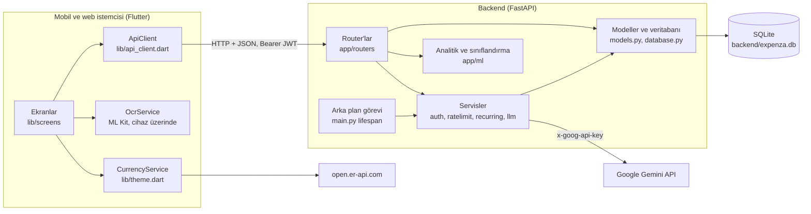

# Tasarım belgesi

Bu belge, BLM497 Ön Tasarım (ÖT) belgesinin teknik kaynağıdır: sistemin bileşenlere ayrışmasını, veri yapılarını, arayüzleri ve kullanılan algoritmaları koddaki haliyle anlatır. UML çizimleri [uml.md](uml.md), performans ölçümleri [performans.md](performans.md), model deneyleri [../backend/ml_training/MODEL_RESULTS.md](../backend/ml_training/MODEL_RESULTS.md) dosyasındadır.

## 1. Tanımlar ve kısaltmalar

| Terim | Anlamı |
|---|---|
| API | Mobil uygulamanın backend'e HTTP üzerinden JSON ile eriştiği arayüz |
| JWT | Girişten sonra verilen imzalı erişim belirteci (HS256) |
| ORM | Veritabanına Python sınıflarıyla erişim katmanı (SQLAlchemy) |
| Migration | Veritabanı şemasındaki değişikliği uygulayan sürümlü betik (Alembic) |
| Seri | Her ay aynı gün tekrarlanan işlemin şablonu (`recurring_series`) |
| TF-IDF | Metni, kelime ve karakter parçalarının ağırlıklı sıklıklarıyla sayısal vektöre çeviren yöntem |
| SVM | Destek vektör makinesi; burada doğrusal (LinearSVC) sınıflandırıcı |
| p50, p95 | İsteklerin %50'sinin ve %95'inin altında kaldığı gecikme süresi |

## 2. Genel yapı

Sistem üç katmandan oluşur: Flutter istemcisi, FastAPI backend'i ve SQLite veritabanı. Backend iki dış servise, istemci bir dış servise bağlanır. Fiş okuma cihaz üzerinde yapılır, görüntü sunucuya gönderilmez.

## 3. Modül ayrıştırma

### Backend (`backend/app`)

| Kimlik | Tür | Amaç ve işlev | Bağımlılıklar |
|---|---|---|---|
| `main.py` | Giriş modülü | Uygulamayı kurar; migration'ları çalıştırır, CORS ve güvenlik başlıklarını ekler, router'ları bağlar, tekrarlayan işlemler için saatlik arka plan görevini başlatır | config, migrate, recurring, routers |
| `config.py` | Yapılandırma | Ortam değişkenlerini ve `backend/.env` dosyasını okur (`Settings`) | pydantic-settings |
| `database.py` | Veri erişimi | Veritabanı motoru, oturum fabrikası, `get_db` bağımlılığı | config, SQLAlchemy |
| `migrate.py` | Altyapı | Açılışta şemayı son migration'a getirir; migration öncesi veritabanlarını tanıyıp başlangıç sürümüne işaretler | Alembic, `migrations/` |
| `models.py` | Veri modeli | `User`, `Transaction`, `RecurringSeries`, `Budget`, `Goal` tabloları ve `CategoryEnum`, `TxType` | database |
| `schemas.py` | Veri sözleşmesi | İstek ve cevap şemaları; girdi doğrulama (tutar, uzunluk, parola kuralı) | Pydantic, models |
| `auth.py` | Servis | Parola hash'leme (bcrypt), JWT üretme ve doğrulama, `get_current_user` | config, models, PyJWT, bcrypt |
| `ratelimit.py` | Servis | Kayan pencereli, bellek içi istek sınırlayıcı | auth |
| `recurring.py` | Servis | Tekrarlayan seri başlatma, durdurma, şablon güncelleme ve eksik ayların üretimi | models, database |
| `llm.py` | Dış servis istemcisi | Gemini'ye istek; anahtar başlıkta, hata ayrıntısı logda | config, httpx |
| `ml/categorizer.py` | Sınıflandırma | Not metninden kategori tahmini (yerel model, kurallar, isteğe bağlı Gemini) | llm, scikit-learn, joblib |
| `ml/analytics.py` | Hesaplama | Ay sonu ve gelecek ay tahmini, z-skoru ile anomali tespiti | yok (saf fonksiyonlar) |
| `ml/insights.py` | Hesaplama | Bu ay ile geçen ayı karşılaştıran doğal dil içgörüleri | yok (saf fonksiyonlar) |
| `routers/auth_router.py` | API | Kayıt, giriş, kullanıcı bilgisi, yapay zekâ onayı | auth, ratelimit |
| `routers/transactions.py` | API | İşlem ekleme, listeleme, özet, güncelleme, silme | categorizer, recurring |
| `routers/budgets.py` | API | Bütçe ekleme/güncelleme, listeleme (bu ayın harcamasıyla), silme | models |
| `routers/goals.py` | API | Tasarruf hedefi oluşturma, katkı, silme | models |
| `routers/analytics.py` | API | Tahmin, anomali ve içgörü uçları; toplamlar SQL'de | ml/analytics, ml/insights |
| `routers/ml_router.py` | API | Canlı kategori önerisi | categorizer, ratelimit |
| `routers/chat.py` | API | Kullanıcının verisiyle Gemini sohbeti (onay gerekli) | llm, ratelimit |

Backend dışındaki yardımcı klasörler: `migrations/` (Alembic, 0001-0005), `ml_training/` (veri üretimi, eğitim, değerlendirme, geri bildirim raporu), `tools/load_test.py` (yük testi), `tests/` (pytest).

### Mobil (`mobile/lib`)

| Kimlik | Tür | Amaç ve işlev |
|---|---|---|
| `main.dart` | Giriş | Uygulamayı başlatır; tema ve para birimini dinler; `ApiClient.session`'a göre giriş ekranı ya da ana kabuk gösterir |
| `api_client.dart` | Veri erişimi | Backend'e giden bütün istekler; token'ı bellekte tutar, 401'de oturumu kapatır |
| `models.dart` | Veri modeli | JSON'dan Dart modellerine dönüşüm |
| `theme.dart` | Ortak | Renkler ve tema; `CurrencyService` (kur çevirisi); ortak bileşenler `Press`, `Rise`, `LoadError` |
| `ocr_service.dart` | Servis | Kamera ya da galeriden fiş görüntüsü alır, ML Kit ile metni okur, toplamı ve işyerini ayrıştırır |
| `screens/home_shell.dart` | Ekran | Beş sekmeli alt menü |
| `screens/login_screen.dart` | Ekran | Giriş ve kayıt |
| `screens/dashboard_screen.dart` | Ekran | Bakiye, gelir/gider, bu ayın dağılımı, son işlemler, sohbet girişi |
| `screens/history_screen.dart` | Ekran | İşlem listesi, arama, kategori filtresi, ekleme düğmesi |
| `screens/add_transaction_screen.dart` | Ekran | Gelir/gider ekleme ve düzenleme, kategori önerisi, fiş tarama, tekrarlama |
| `screens/analytics_screen.dart` | Ekran | Tahmin, trend, harcama hızı, anomaliler |
| `screens/budgets_screen.dart` | Ekran | Toplam ve kategori bütçeleri |
| `screens/goals_screen.dart` | Ekran | Tasarruf hedefleri |
| `screens/profile_screen.dart` | Ekran | İçgörüler, tema, para birimi, yapay zekâ onayı, çıkış |
| `screens/chat_screen.dart` | Ekran | Onay paneli ve sohbet |

## 4. Veri ayrıştırma

Tutarlar TL cinsinden `FLOAT` olarak saklanır. Kategori ve tür sütunları enum adlarını tutar (ör. `yemek`, `expense`).

**users**

| Sütun | Tür | Boş | Açıklama |
|---|---|---|---|
| id | INTEGER | hayır | Birincil anahtar |
| email | VARCHAR(255) | hayır | Benzersiz, indeksli |
| hashed_password | VARCHAR(255) | hayır | bcrypt hash'i |
| display_name | VARCHAR(120) | hayır | Görünen ad |
| created_at | DATETIME | hayır | Kayıt zamanı |
| ai_consent_at | DATETIME | evet | Sohbet için veri paylaşımı onayının zamanı; boşsa onay yok |

**transactions**

| Sütun | Tür | Boş | Açıklama |
|---|---|---|---|
| id | INTEGER | hayır | Birincil anahtar |
| user_id | INTEGER | hayır | `users.id`, indeksli |
| amount | FLOAT | hayır | TL, 0'dan büyük, en fazla 1 milyar |
| type | ENUM | hayır | `income` / `expense` |
| category | ENUM | hayır | Sekiz işlem kategorisinden biri |
| auto_categorized | BOOLEAN | hayır | Kategoriyi kullanıcı değil model atadıysa doğru |
| suggested_category | ENUM | evet | Kayıt anında gösterilen öneri |
| suggestion_confidence | FLOAT | evet | Önerinin güveni (0-1) |
| suggestion_model | VARCHAR(40) | evet | Öneriyi veren model |
| is_recurring | BOOLEAN | hayır | Aktif bir seriye ait mi |
| series_id | INTEGER | evet | `recurring_series.id`, indeksli |
| note | VARCHAR(500) | hayır | Serbest metin not |
| occurred_on | DATE | hayır | İşlem tarihi |
| created_at | DATETIME | hayır | Kayıt zamanı |

Kısıt: `(series_id, occurred_on)` benzersiz; aynı seriden aynı güne iki kayıt yazılamaz.

**recurring_series**

| Sütun | Tür | Açıklama |
|---|---|---|
| id, user_id | INTEGER | Birincil anahtar, sahibi |
| amount, type, category, note | | Her ay üretilecek işlemin şablonu |
| day_of_month | INTEGER | Ayın günü; kısa aylarda ayın son gününe kayar |
| start_on | DATE | İlk işlemin tarihi |
| last_generated_on | DATE | En son üretilen ayın tarihi; silinen ayın yeniden üretilmesini önler |
| active | BOOLEAN | Seri durdurulduysa yanlış |

**budgets**: `id`, `user_id`, `category` (sekiz kategori ya da `Toplam`), `monthly_limit` (TL).

**goals**: `id`, `user_id`, `title` (1-120 karakter), `target_amount`, `current_amount`, `deadline` (boş olabilir), `created_at`.

Şema sürümleri (`backend/migrations/versions`):

| Sürüm | Değişiklik |
|---|---|
| 0001 | Başlangıç şeması (migration öncesi `create_all` düzeni) |
| 0002 | `transactions.is_recurring` (yalnızca eksikse) |
| 0003 | `recurring_series` tablosu, `transactions.series_id`; eski tekrarlayan kayıtların serilere bağlanması |
| 0004 | `users.ai_consent_at` |
| 0005 | Öneri alanları (`suggested_category`, `suggestion_confidence`, `suggestion_model`) |

## 5. Arayüz açıklaması

### REST API

Kimlik doğrulaması gereken uçlar `Authorization: Bearer <JWT>` başlığı ister; yoksa ya da geçersizse 401 döner. Bütün kayıtlar token'daki kullanıcıya göre süzülür; başka bir kullanıcının kaydının ID'si verilirse işlem güncelleme ve hedef uçları 404, işlem ve bütçe silme uçları 204 döner; her durumda kayda dokunulmaz. Doğrulama hataları 422, istek sınırı aşımı 429 döner.

| Yöntem ve yol | Giriş | Girdi | Çıktı |
|---|---|---|---|
| GET `/` | hayır | | Sağlık bilgisi |
| POST `/auth/register` | hayır | e-posta, parola (en az 8, harf ve rakam), görünen ad | Kullanıcı (201); kayıtlı e-posta 400 |
| POST `/auth/login` | hayır | form: `username` (e-posta), `password` | `access_token` (7 gün); hatalı 401 |
| GET `/auth/me` | evet | | Kullanıcı, onay zamanı |
| POST / DELETE `/auth/me/ai-consent` | evet | | Onay verilir / geri çekilir |
| POST `/transactions` | evet | tutar, tür, kategori (boşsa giderde model atar), not, tarih, tekrarla, gösterilen öneri | İşlem (201) |
| GET `/transactions` | evet | `limit` (1-500), `category`, `type`, `month` (YYYY-MM), `q` | İşlemler, yeniden eskiye |
| GET `/transactions/summary` | evet | | Bakiye, toplamlar, bu ayın kategori dağılımı |
| PUT `/transactions/{id}` | evet | Değişen alanlar; `is_recurring` seriyi başlatır ya da durdurur | İşlem |
| DELETE `/transactions/{id}` | evet | | 204 |
| POST `/budgets` | evet | kategori, aylık limit | Bütçe ve bu ayın harcaması (varsa günceller) |
| GET `/budgets` | evet | | Bütçeler ve bu ayın harcamaları |
| DELETE `/budgets/{id}` | evet | | 204 |
| POST `/goals` | evet | başlık, hedef tutar, son tarih | Hedef (201) |
| GET `/goals` | evet | | Hedefler ve ilerleme |
| POST `/goals/{id}/contribute` | evet | tutar | Hedef |
| DELETE `/goals/{id}` | evet | | 204 |
| GET `/analytics/forecast` | evet | | Ay sonu ve gelecek ay tahmini, harcama hızı, geçmiş aylar |
| GET `/analytics/anomalies` | evet | | En fazla 10 olağandışı harcama |
| GET `/analytics/insights` | evet | | İçgörü cümleleri |
| POST `/ml/categorize` | evet | `text` (en fazla 500) | Kategori, güven, model adı |
| POST `/chat` | evet + onay | `message` (1-1000) | Cevap; onay yoksa 403, Gemini hatasında 502 |

Ayrıntılı şemalar backend çalışırken `/docs` adresinde (OpenAPI) görülebilir.

### Dış arayüzler

| Arayüz | Kullanan | Veri | Not |
|---|---|---|---|
| Google Gemini `generateContent` | `llm.py` | Sohbette son 30 işlem, bütçeler, hedefler ve soru | Yalnızca anahtar tanımlı ve kullanıcı onaylıysa |
| open.er-api.com | `CurrencyService` | Yalnızca TRY kur isteği | Kişisel veri gönderilmez; hata olursa sabit kurlar kullanılır |
| Google ML Kit (cihaz üzerinde) | `OcrService` | Fiş görüntüsü | Görüntü cihazdan çıkmaz; web'de kapalı |

## 6. Ayrıntılı tasarım

### Kategori sınıflandırma

`categorize(metin)` önce ayara bakar: `CATEGORIZER=gemini` ve anahtar tanımlıysa Gemini denenir, cevap alınamazsa yerel modele geçilir. Varsayılan olarak doğrudan yerel model kullanılır.

Yerel model (`ml_training/train_baseline.py`):

- Kelime TF-IDF: 1-2 kelimelik parçalar, `min_df=2`, aksanlar kaldırılır (ilac ve ilaç aynı sayılır).
- Karakter TF-IDF (`char_wb`): 2-5 karakterlik parçalar; ekleri yakalar (eczaneden ve eczane).
- İki öznitelik birleştirilir ve `CalibratedClassifierCV(LinearSVC(C=1.0), sigmoid, cv=3)` ile sınıflandırılır; kalibrasyon güven yüzdesi verir.
- Eğitim verisi `generate_data.py` ile üretilen 6.400 sentetik örnektir (%20 test ayrılır). Gerçek doğrulama seti 46 örnektir.

Model dosyası yoksa ya da yüklenemezse anahtar kelime kuralları kullanılır: her kategorinin kelime listesindeki eşleşmeler sayılır, en çok eşleşen kategori seçilir, güven `min(0.5 + 0.15 × eşleşme, 0.95)`.

### Harcama tahmini (`forecast_from_totals`)

1. Bu ayın harcaması geçen gün sayısına bölünüp ayın gün sayısıyla çarpılır (koşu hızı, ay sonu tahmini).
2. Gelecek ay: en az iki tamamlanmış ay varsa aylık toplamlara en küçük kareler doğrusu uydurulup bir sonraki ay tahmin edilir; tek ay varsa o ayın toplamı; hiç yoksa ay sonu tahmini kullanılır.
3. Harcama hızı: ay sonu tahmini geçmiş ayların ortalamasının 1,15 katından büyükse "Yüksek", 0,85 katından küçükse "Düşük", arada "Normal".

### Anomali tespiti (`detect_anomalies`)

Her kategori için, en az 4 gider varsa ortalama ve standart sapma hesaplanır. Z-skoru 2,5 ya da üstü olan ve ortalamanın üstündeki harcamalar işaretlenir; z-skoru 3,5 ve üstü "yüksek", altı "orta" önemdedir. En yüksek z-skorlu 10 kayıt döner.

### İçgörüler (`generate_insights`)

- Bu ayın toplam harcaması geçen aya göre en az %10 arttıysa uyarı, en az %10 azaldıysa olumlu mesaj.
- Geçen aya göre en az %25 artan kategorilerden en çok artanı.
- Bu ay en çok harcanan kategori ve payı.
- Bu ay gelir varsa tasarruf oranı ya da gelirin aşıldığı uyarısı.
- Hiçbiri yoksa "Henüz yeterli veri yok".

### Tekrarlayan işlemler

Seri başlatılınca ilk işlem serinin ilk kaydı olur. Üretim `last_generated_on` tarihinin ayından başlar, ay ay ilerler; her ay için gün `min(day_of_month, ayın son günü)` olarak hesaplanır, bugünden sonraki ilk aya gelince durur. Her seri ayrı commit edilir; benzersizlik kısıtı ihlal edilirse (başka bir süreç aynı ayı üretmişse) o seri için işlem geri alınır. Etkinlik çizimi [uml.md](uml.md) dosyasındadır.

### Kimlik doğrulama ve sınırlar

- Parola bcrypt ile (varsayılan maliyet, rastgele tuz) hash'lenir; 72 bayttan uzun kısmı bcrypt'in sınırı gereği kesilir.
- JWT: HS256, `sub` (e-posta), `iat`, `exp` (7 gün); `exp` ve `sub` zorunlu, imzasız token reddedilir. `SECRET_KEY` en az 32 karakter olmazsa backend açılmaz.
- Kullanıcı yoksa da sahte bir bcrypt kontrolü yapılır; cevap süresi e-postanın kayıtlı olup olmadığını ele vermez.
- İstek sınırları (kayan pencere, bellek içi):

| Sınır | Değer |
|---|---|
| Giriş, IP başına | dakikada 20 |
| Hatalı parola, e-posta başına | 15 dakikada 5 (sonra doğru parola da 429) |
| Kayıt, IP başına | saatte 10 |
| Sohbet, kullanıcı başına | dakikada 20 |
| Kategori önerisi, kullanıcı başına | dakikada 60 |

### İstemci tarafı

- Bütçe durumu: harcanan / limit oranı %75'ten küçükse "Yolunda", %75-90 "Dikkat", %90-100 "Kritik", %100 ve üstü "Aşıldı".
- Kategori önerisi not en az 3 karakter olunca, son tuştan 450 ms sonra istenir.
- Para birimi yalnızca gösterimdir; tutarlar kaydedilmeden önce TL'ye çevrilir ve geçmiş tutarlar güncel kurla gösterilir.

## 7. Gereksinimlerin tasarımla izlenebilirliği

| Gereksinim | Tasarım varlıkları |
|---|---|
| Hesap açma ve güvenli giriş | `auth.py`, `ratelimit.py`, `routers/auth_router.py`, `login_screen.dart` |
| Gelir ve gider kaydı | `routers/transactions.py`, `add_transaction_screen.dart`, `history_screen.dart` |
| Otomatik kategori önerisi | `ml/categorizer.py`, `routers/ml_router.py`, `ml_training/` |
| Az sürtünmeli veri girişi (fiş) | `ocr_service.dart` |
| Tekrarlayan gelir ve gider | `recurring.py`, `models.RecurringSeries`, migration 0003 |
| Bakiye ve aylık dağılım | `GET /transactions/summary`, `dashboard_screen.dart` |
| Bütçe takibi | `routers/budgets.py`, `budgets_screen.dart` |
| Tasarruf hedefleri | `routers/goals.py`, `goals_screen.dart` |
| Tahmin ve anomali | `ml/analytics.py`, `routers/analytics.py`, `analytics_screen.dart` |
| Kişisel içgörüler | `ml/insights.py`, `profile_screen.dart` |
| Sohbet asistanı ve açık rıza | `routers/chat.py`, `llm.py`, `chat_screen.dart`, `profile_screen.dart` |
| Model doğruluğunun ölçülmesi | `ml_training/evaluate.py`, `ml_training/feedback_report.py` |
| Güvenlik (OWASP) | `auth.py`, `ratelimit.py`, `schemas.py`, `main.py` (CORS, başlıklar) |
| Sürdürülebilirlik (CI) | `.github/workflows/ci.yml`, `backend/tests`, `mobile/test` |
| Performans | `routers/analytics.py`, `tools/load_test.py`, `docs/performans.md` |
