# UML çizimleri

GŞÖA'nın "Ön Analiz" bölümünün istediği beş çizim: kullanım durumu, sınıf, sıra, durum makinesi ve etkinlik. Çizimler koddaki gerçek sınıflara, uçlara ve eşik değerlere göre hazırlandı; kod değiştikçe güncellenmelidir.

Çizimler Mermaid ile yazıldı. GitHub bu dosyayı açınca çizimleri gösterir. Rapora koymak için bir çizimin kodunu [mermaid.live](https://mermaid.live) sayfasına yapıştırıp PNG ya da SVG olarak indirebilir veya `npx @mermaid-js/mermaid-cli -i uml.md` ile dışa aktarabilirsiniz.

## 1. Kullanım durumu (use case) çizimi

Mermaid'de ayrı bir use case çizim türü olmadığı için aktörler köşeli, kullanım durumları oval kutularla gösterildi. Kesikli oklar `include` (her zaman dahil) ve `extend` (isteğe bağlı) ilişkileridir.

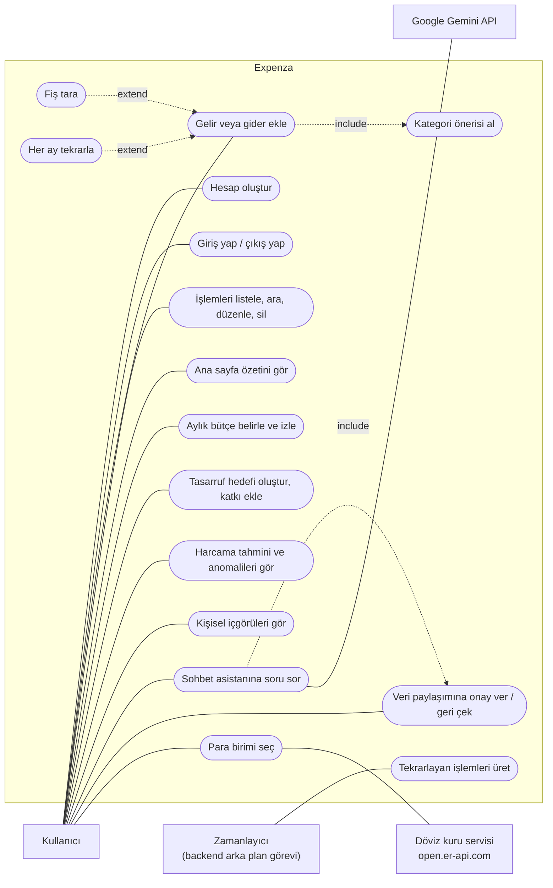

| Kullanım durumu | Nerede |
|---|---|
| Hesap oluştur, giriş/çıkış | `POST /auth/register`, `POST /auth/login`; `login_screen.dart` |
| Gelir veya gider ekle | `POST /transactions`; `add_transaction_screen.dart` |
| Kategori önerisi al | `POST /ml/categorize`; `app/ml/categorizer.py` |
| Fiş tara | `ocr_service.dart` (cihaz üzerinde ML Kit, yalnızca mobil) |
| Her ay tekrarla / tekrarlayan işlemleri üret | `app/recurring.py`, `main.py` (saatlik görev) |
| Ana sayfa özeti | `GET /transactions/summary`; `dashboard_screen.dart` |
| Bütçe | `/budgets`; `budgets_screen.dart` |
| Tasarruf hedefi | `/goals`; `goals_screen.dart` |
| Tahmin ve anomaliler | `/analytics/forecast`, `/analytics/anomalies`; `analytics_screen.dart` |
| İçgörüler | `/analytics/insights`; `profile_screen.dart` |
| Sohbet ve onay | `POST /chat`, `/auth/me/ai-consent`; `chat_screen.dart` |
| Para birimi | `CurrencyService` (`theme.dart`); `profile_screen.dart` |

## 2. Sınıf çizimleri

### Veri modeli

`backend/app/models.py` içindeki tablolar. Tutarlar TL olarak saklanır.

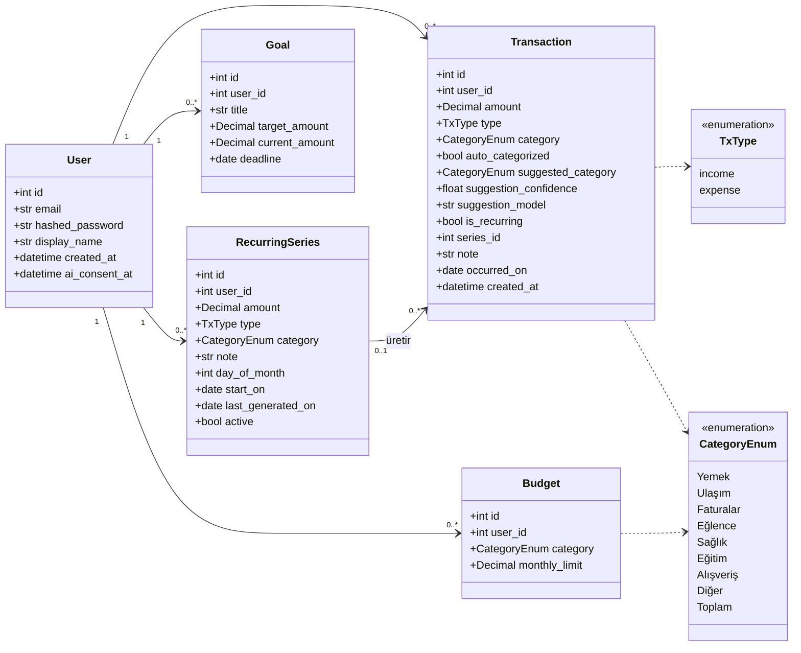

`Toplam` yalnızca bütçede kullanılır (aylık toplam bütçe); işlemler için geçerli bir kategori değildir.

### Kategori sınıflandırıcıları

`backend/app/ml/categorizer.py`. Hepsi aynı `predict` sözleşmesini uygular; `categorize()` hangisinin kullanılacağına karar verir.

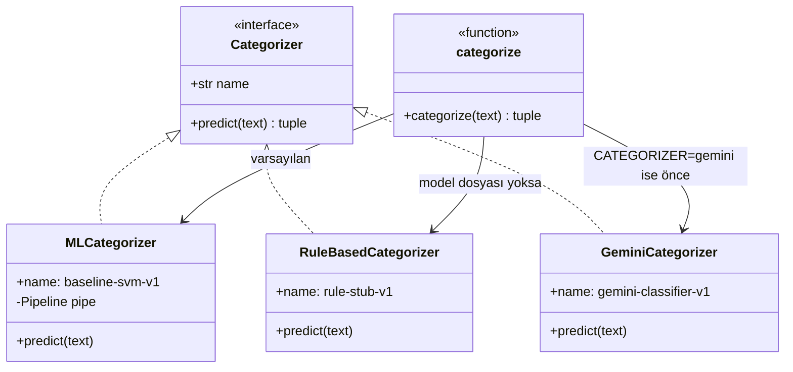

## 3. Sıra (sequence) çizimleri

### Giriş

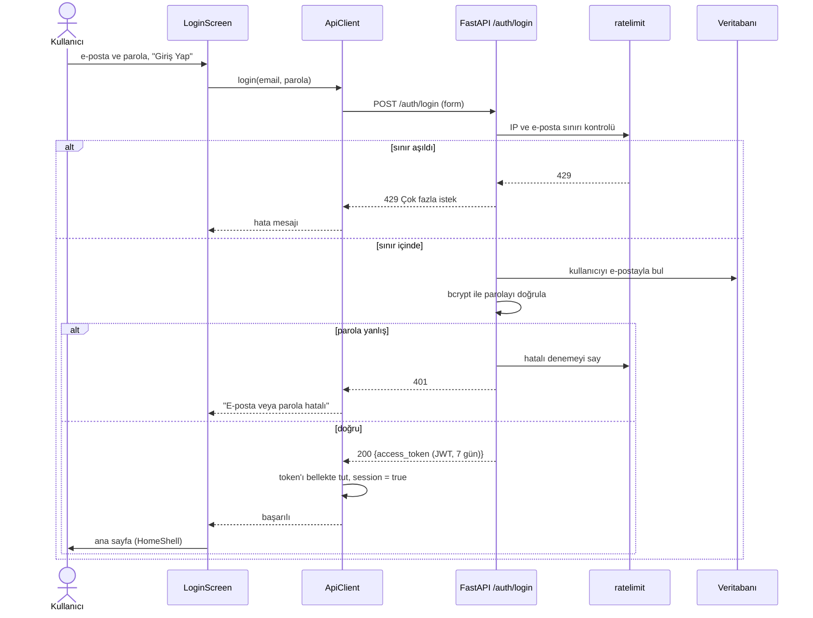

### Gider ekleme ve kategori önerisi

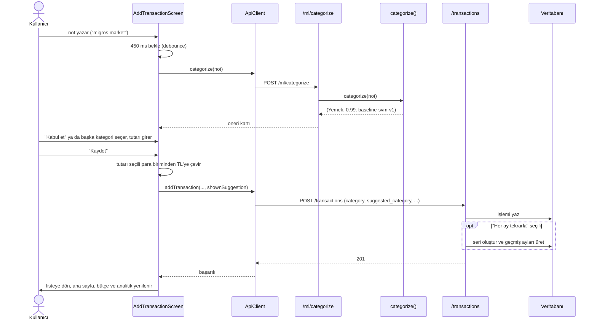

### Sohbet asistanı ve açık rıza

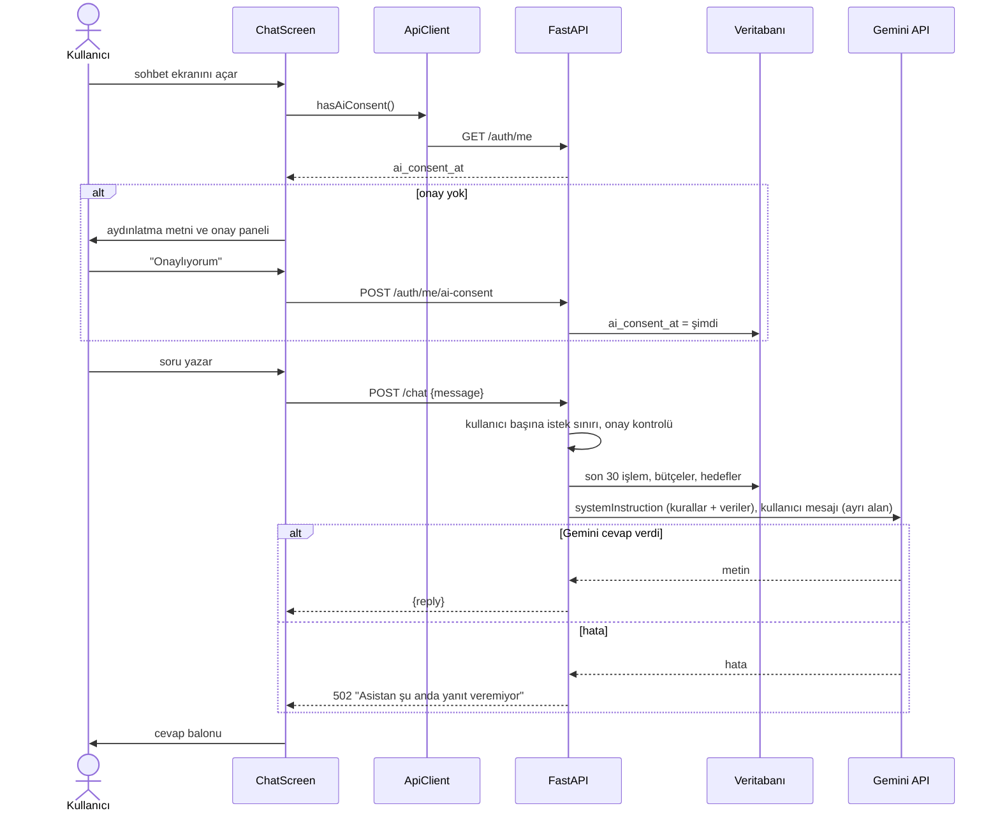

## 4. Durum makinesi çizimleri

### Kategori bütçesinin durumu

`budgets_screen.dart`'taki eşikler: harcanan / aylık limit oranına göre. Ay değişince harcanan tutar sıfırdan başlar.

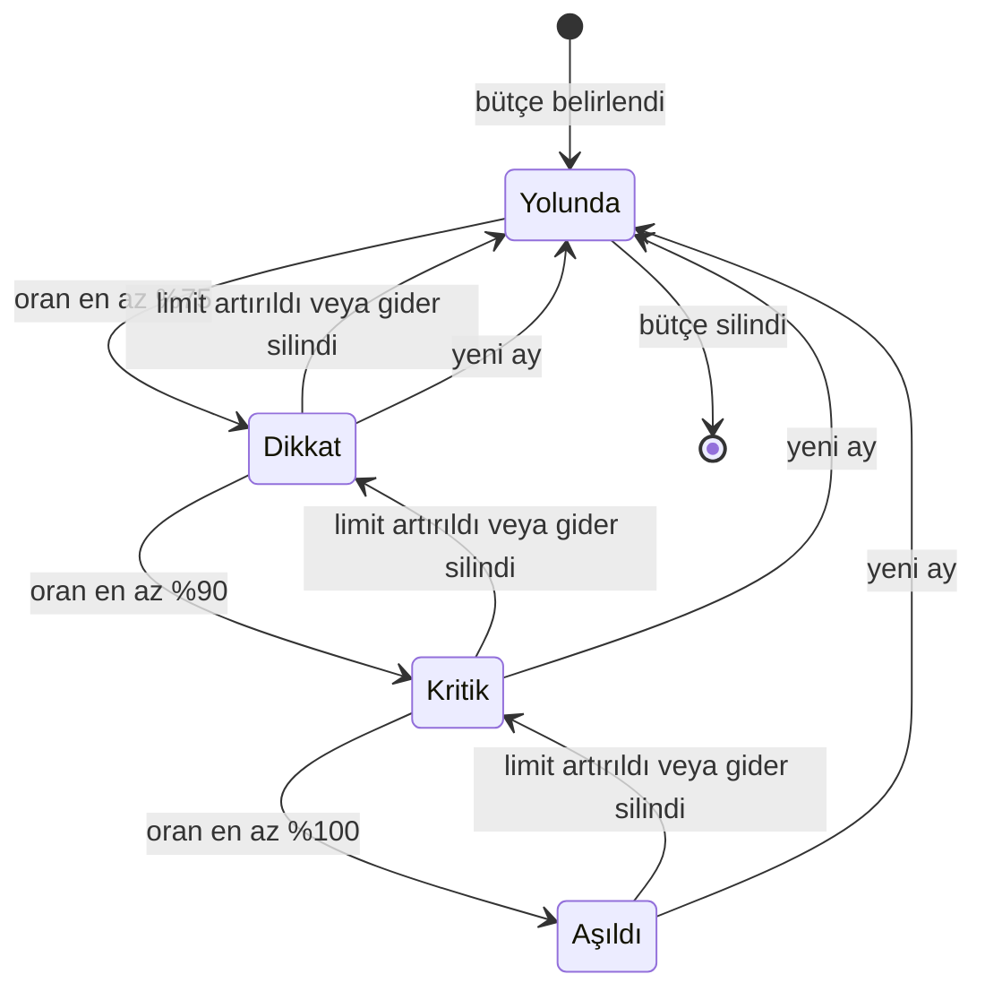

### Tekrarlayan işlem serisi

`app/recurring.py`. Durdurulan bir seri yeniden başlatılmaz; işaret tekrar konursa yeni bir seri açılır.

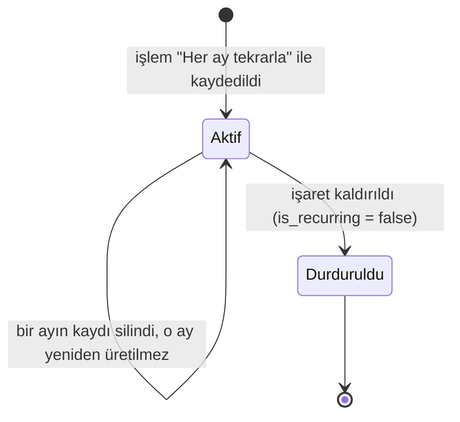

### Uygulama oturumu

`ApiClient.session` ve `_AuthGate` (`main.dart`).

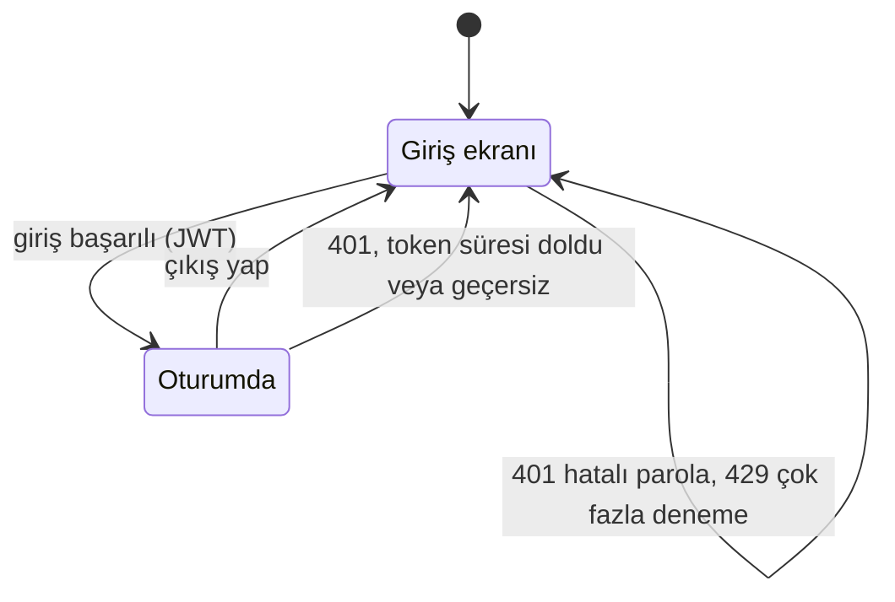

## 5. Etkinlik (activity) çizimleri

### Gelir veya gider ekleme

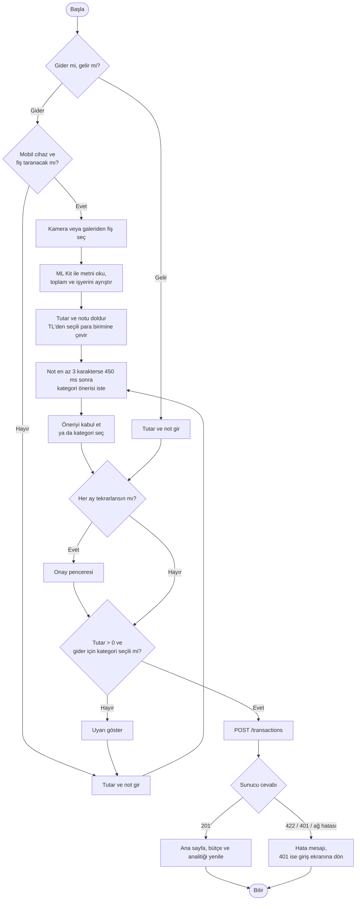

### Tekrarlayan işlemlerin üretilmesi

Sunucu açılışta ve saatte bir `materialize_all()` çalıştırır.

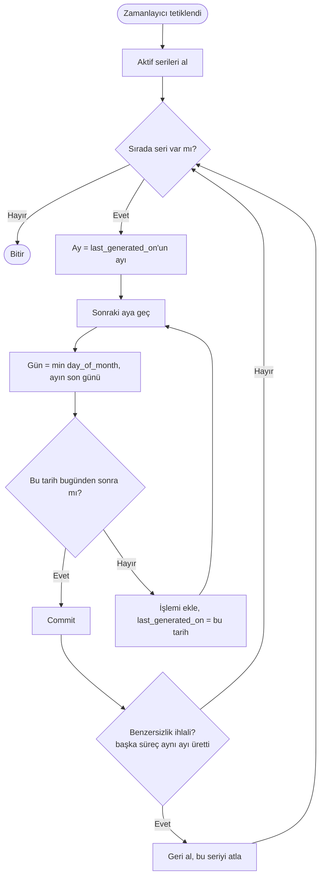
